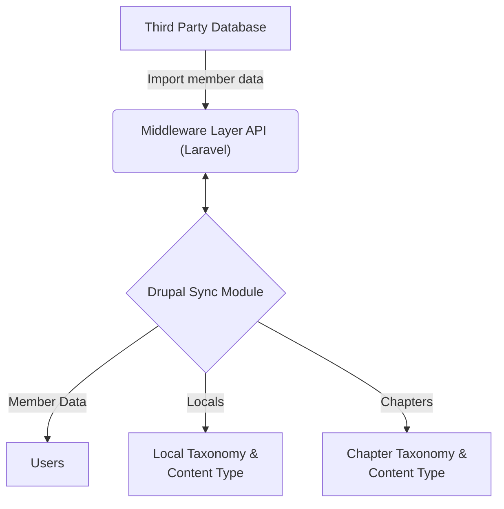

# Sample Drupal Module

#### Important Caveats
Please note that this module is heavily modified from the original source and does not include all dependencies, so you will not be able to run this module on your own installation. It's also been rewritten from the original with different intents and outcomes, but should still be a good example of how to write a Drupal module that performs a CRON job.

### Description
This is a sample Drupal project that was built for a client with very specific needs involving integration with their third-party membership database software.

Sitting between the Drupal installation and their third-party membership software is a middleware layer that acts as a RESTful API. This API is used to pull data from the third-party database and push it to the Drupal database.

The Sample Drupal Module performs a CRON job that pulls data from the middleware application and updates the Drupal database with the latest information.

Information that is pulled from this middleware layer includes:

* Membership IDs
* Member personal information
* Locals
* Chapters

The cron job will run once a day and pull all of the latest information from the middleware layer and update the Drupal database accordingly.

Each member in Drupal has fields including their first name, last name, address, as well as what Locals and Chapters they belong to. This sync module will not only import Locals and Chapters into their respective taxonomies in Drupal, it will also update every member's associated Locals and Chapters fields.

